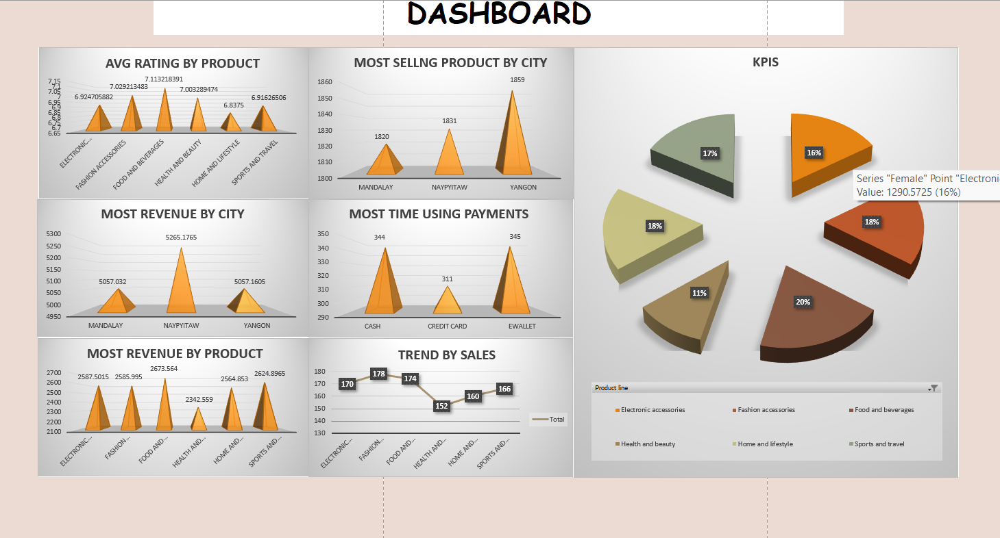

# 📊 Supermarket Sales Dashboard

An Excel-based sales dashboard built to analyze supermarket performance 
across products, cities, and customer segments using real transaction data.

---

## 🗂️ Project Overview

This project transforms 1,000 rows of raw supermarket sales data into a 
fully interactive Excel dashboard. It highlights key business metrics, 
customer trends, and product-level insights through clean visualizations 
and structured reporting.

---

## ✨ Features

- 📌 **KPI Tracking** – Monitor tax, revenue, and gross income at a glance
- 📈 **Sales Trend Analysis** – Track performance over time by category
- 🏙️ **City-wise Comparison** – Yangon, Mandalay, and Naypyitaw breakdown
- 🛒 **Category Performance** – Compare all 6 product lines side by side
- 💳 **Payment Method Analysis** – Cash, Credit Card, and E-wallet insights
- ⭐ **Customer Ratings** – Average satisfaction score per product category
- 🎨 **Interactive Dashboard** – Clean visual layout for quick decision-making

---

## 🛠️ Tools & Skills Used

| Area | Details |
|---|---|
| **Tool** | Microsoft Excel |
| **Techniques** | Pivot Tables, Charts & Graphs, Dashboard Design |
| **Process** | Data Cleaning, Data Visualization, Reporting |

---

## 📁 Files Included

| File | Description |
|---|---|
| `supermarket-sales-dashboard.xlsx` | Main dashboard with all sheets and visualizations |

---

## 💡 Business Insights

- 🥇 **Food & Beverages** generated the highest gross income (~₹2,673)
- 🏆 **Naypyitaw** led all cities in total revenue
- 👛 **E-wallet** was the most preferred payment method (345 transactions)
- ⭐ **Food & Beverages** also had the highest average customer rating (7.11)
- 👩 **Female customers** contributed slightly more to overall tax revenue

---

## 🎯 Learning Outcome

This project strengthened practical skills in Excel dashboarding, data 
storytelling, and analytical reporting — directly applicable to 
**Data Analyst** and **MIS Reporting** roles.

## Dashboard Preview

